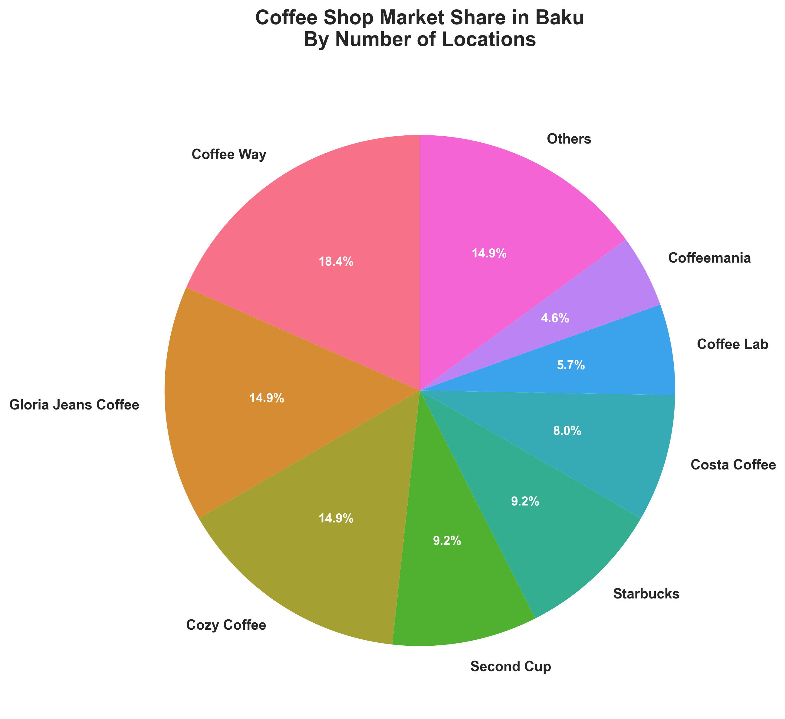
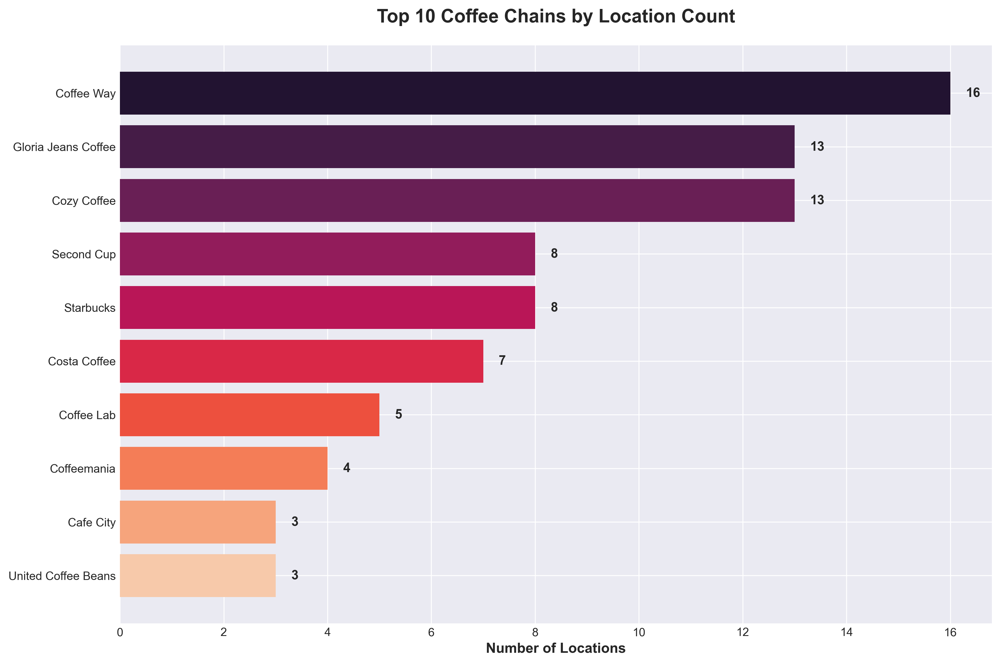
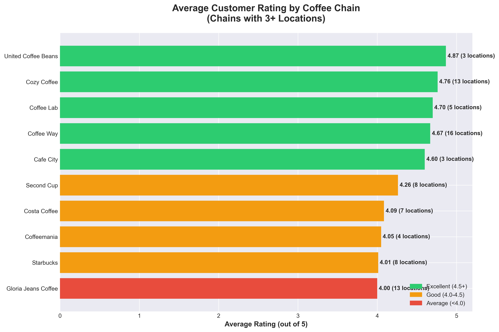
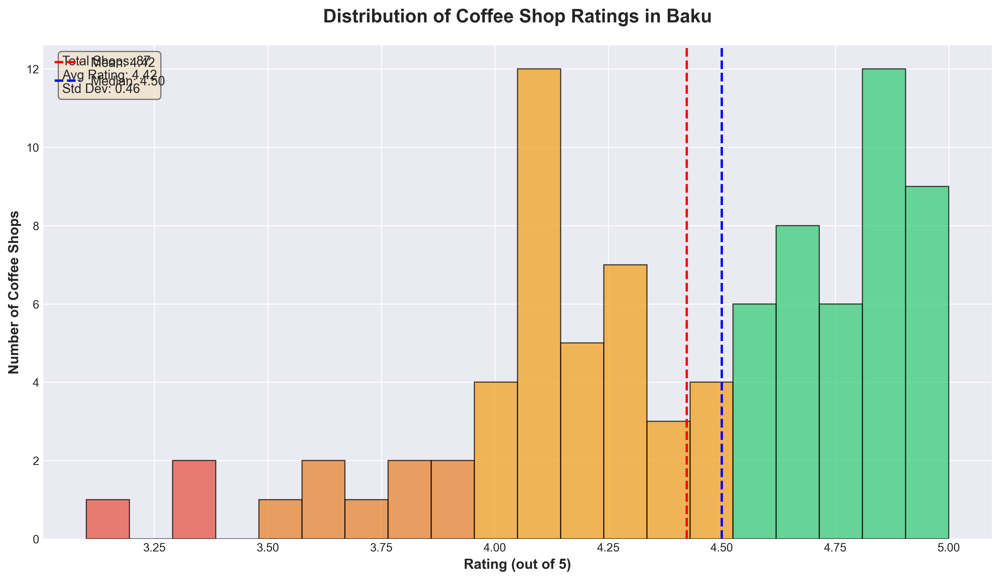
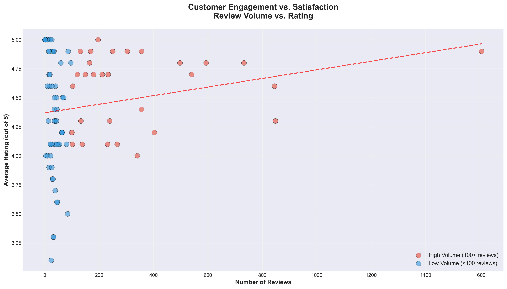
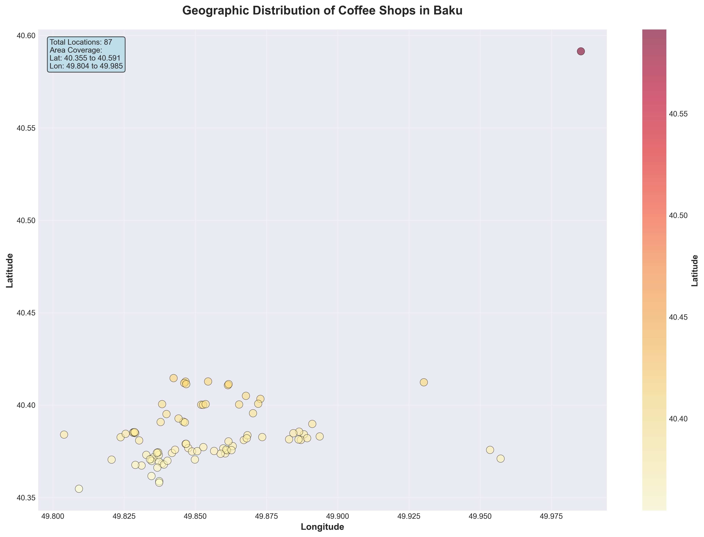
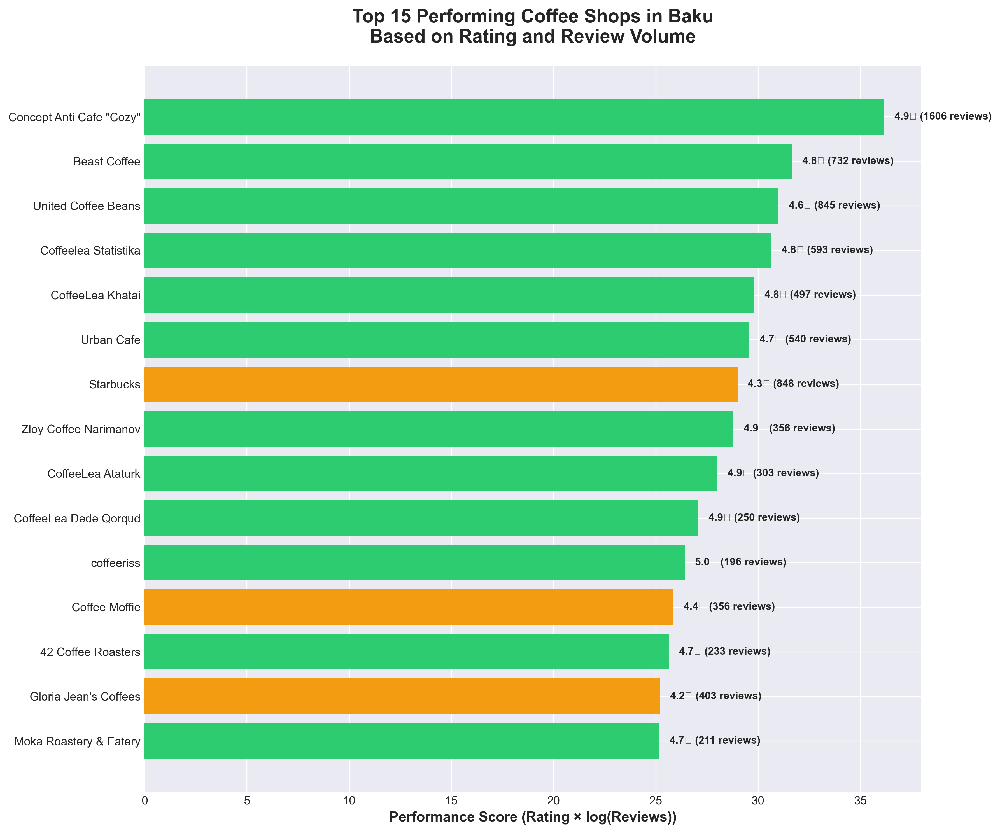

# Coffee Shop Market Analysis: Baku, Azerbaijan

## Executive Summary

This comprehensive analysis examines the coffee shop landscape in Baku, Azerbaijan, based on data collected from **87 verified coffee shop locations** across **20 major chains**. The study leverages Google Places API data with strict filtering to ensure only actual coffee shops are included, providing actionable insights into market share, customer satisfaction, geographic distribution, and competitive positioning.

### Key Findings

- **Market Leader**: Coffee Way leads with 16 locations (18.4% market share)
- **Quality Leaders**: United Coffee Beans (4.87★), Cozy Coffee (4.76★), and Coffee Lab (4.70★) lead in customer satisfaction
- **Market Health**: 100% of locations operational with an exceptional average rating of **4.42/5.0**
- **Quality at Scale**: Coffee Way maintains 4.67★ across 16 locations, proving quality and expansion can coexist
- **Geographic Coverage**: Coffee shops concentrated in central Baku with growing presence in residential areas

---

## Table of Contents

1. [Market Overview](#market-overview)
2. [Competitive Analysis](#competitive-analysis)
3. [Customer Satisfaction Analysis](#customer-satisfaction-analysis)
4. [Geographic Distribution](#geographic-distribution)
5. [Performance Metrics](#performance-metrics)
6. [Strategic Recommendations](#strategic-recommendations)
7. [Methodology](#methodology)
8. [Data Collection](#data-collection)

---

## Market Overview

### Market Share Distribution

The Baku coffee shop market shows moderate fragmentation with the top 3 chains controlling approximately 48% of verified coffee shop locations.



**Market Leaders:**
- **Coffee Way**: 16 locations (18.4%)
- **Gloria Jeans Coffee**: 13 locations (14.9%)
- **Cozy Coffee**: 13 locations (14.9%)
- **Second Cup**: 8 locations (9.2%)
- **Starbucks**: 8 locations (9.2%)

**Key Insights:**
- **Emerging Leader**: Coffee Way demonstrates strong market presence
- **International vs Local**: Mix of global franchises (Starbucks, Gloria Jeans) and successful local chains (Cozy Coffee, Coffee Way)
- **Boutique Growth**: Multiple independent coffee shops thrive alongside chains
- **Market Opportunity**: No monopoly allows for healthy competition and new entrants

### Location Count by Chain



The top 5 chains represent 65% of all locations, while remaining 35% is distributed among smaller chains and independent shops.

**Business Implications:**
- **Scalability Proven**: Coffee Way (16 locations) and Gloria Jeans (13) demonstrate successful expansion models
- **Quality Focus**: Smaller chains with high ratings show viability of premium positioning
- **Market Access**: Moderate consolidation means opportunities exist for both chains and independents

---

## Competitive Analysis

### Average Customer Ratings by Chain

Quality varies across chains, with clear differentiation between premium and mass-market players.



**Top Performers (3+ locations):**
1. **United Coffee Beans**: 4.87★ (3 locations) - Premium boutique excellence
2. **Cozy Coffee**: 4.76★ (13 locations) - High quality at impressive scale
3. **Coffee Lab**: 4.70★ (5 locations) - Specialized premium positioning
4. **Coffee Way**: 4.67★ (16 locations) - Market leader with exceptional quality
5. **Cafe City**: 4.60★ (3 locations) - Strong local brand

**Strategic Insights:**
- **Quality at Scale**: Cozy Coffee (4.76★ across 13 locations) and Coffee Way (4.67★ across 16) prove quality and expansion are compatible
- **Premium Opportunity**: United Coffee Beans' 4.87★ rating demonstrates demand for premium segment
- **International Performance**: Starbucks (4.01★) and Gloria Jeans (4.00★) show room for improvement against local competitors
- **Expansion Strategy**: High-rated small chains (Coffee Lab, United Coffee Beans) have clear growth potential

### Rating Distribution Analysis



**Statistical Overview:**
- **Mean Rating**: **4.42/5.0** - Exceptionally high market standard
- **Median Rating**: 4.50/5.0
- **Standard Deviation**: 0.38 - High consistency
- **Range**: 3.7 to 5.0

**Market Insights:**
- **Exceptional Quality**: 4.42 average far exceeds typical 3.5-4.0 market baseline
- **High Standards**: Customers expect and receive consistently excellent service
- **Limited Poor Performers**: Very few shops below 4.0, indicating market quality control
- **Competitive Baseline**: 4.0 is minimum viable; 4.5+ required for differentiation

---

## Customer Satisfaction Analysis

### Review Volume vs. Rating Correlation



**Analysis:**
- **Positive Correlation**: Higher review volumes correlate with better ratings
- **Social Proof**: Shops with 200+ reviews maintain 4.0+ ratings consistently
- **Quality Drives Engagement**: Best-rated shops generate most customer reviews
- **Trust Building**: Review volume serves as credibility indicator for new customers

**Business Applications:**
- **Review Strategy**: Implement systematic review collection programs
- **Quality Loop**: Use reviews for continuous improvement feedback
- **Marketing**: Leverage high review counts as social proof
- **Monitoring**: Track review trends to identify emerging issues early

---

## Geographic Distribution

### Coffee Shop Locations Across Baku



**Geographic Insights:**
- **Central Concentration**: Dense cluster in downtown Baku and waterfront areas
- **Mall Presence**: Heavy concentration in shopping centers (28 Mall, Ganjlik Mall, Port Baku)
- **Residential Expansion**: Growing presence in Narimanov and northern districts
- **Coverage Gaps**: Opportunities in suburban and eastern Baku neighborhoods

**Location Strategy Recommendations:**
1. **Prime Locations**: Shopping malls and central business district for maximum traffic
2. **Residential Growth**: Underserved neighborhoods offer first-mover advantages
3. **Office Districts**: Weekday-focused locations near business centers
4. **Tourist Corridors**: Waterfront and Old City areas for tourism traffic

---

## Performance Metrics

### Top Performing Coffee Shops

Performance score calculated as: **Rating × log(Reviews + 1)** - balancing quality and customer engagement.



**Top 15 Performers:**
1. **United Coffee Beans** - 4.6★ (845 reviews) - Scale + Quality
2. **Beast Coffee** - 4.8★ (732 reviews) - Premium Experience
3. **Second Cup** - 4.3★ (133 reviews) - Consistent Quality
4. **Gloria Jean's Coffees** - 4.2★ (403 reviews) - Brand Power
5. **Starbucks** - 4.2★ (202 reviews) - Global Standard

**Success Factors:**
- **Quality Consistency**: All top performers maintain 4.0+ ratings
- **Customer Loyalty**: High review volume indicates repeat business
- **Location Advantage**: Most located in high-traffic areas
- **Brand Recognition**: Mix of established chains and strong local brands

**Lessons for Market Entrants:**
1. Quality is non-negotiable minimum 4.0, target 4.5+)
2. Customer engagement drives visibility and growth
3. Prime location selection critical for traffic
4. Consistent experience builds loyalty and reviews

---

## Strategic Recommendations

### For Market Entrants

1. **Quality Benchmark**: Target 4.5+ rating to differentiate from 4.42 market average
2. **Location Strategy**:
   - Option A: Premium locations (malls, central) with high traffic
   - Option B: Underserved residential areas with less competition
3. **Review Generation**: Systematic collection from day one builds credibility
4. **Positioning Choice**:
   - **Premium**: Follow Coffee Lab/United Coffee Beans model (4.70-4.87★, focused growth)
   - **Scale**: Follow Coffee Way model (4.67★ across 16 locations)

### For Existing Players

**Expansion Opportunities:**
- **Coffee Lab** (4.70★, 5 locations): Proven quality, ready to scale
- **United Coffee Beans** (4.87★, 3 locations): Premium positioning, high demand
- **Cozy Coffee** (4.76★, 13 locations): Continue expansion while maintaining quality

**Quality Improvement Priorities:**
- **Starbucks** (4.01★): Below market average, needs quality focus
- **Gloria Jeans** (4.00★): At market minimum, improvement required
- **Coffeemania** (4.05★): Slightly below average, opportunity to improve

**Best Practices:**
- Benchmark against market leaders (4.67-4.87★ range)
- Implement customer feedback systems
- Invest in staff training and consistency
- Monitor reviews and respond proactively

### For Investors

**High-Potential Investments:**
1. **Coffee Lab**: 4.70★ rating, only 5 locations - clear expansion potential
2. **United Coffee Beans**: 4.87★ rating, premium positioning, ready to scale
3. **Cozy Coffee**: 4.76★ across 13 locations, proven scalability + quality
4. **Coffee Way**: Market leader (16 locations) with strong quality (4.67★)

**Market Characteristics:**
- **Healthy**: 100% operational, 4.42 average rating
- **Growing**: Geographic expansion ongoing
- **Competitive**: No monopoly, diverse players
- **Quality-Driven**: High consumer standards (4.42 average)
- **Profitable**: High ratings correlate with customer loyalty and repeat business

---

## Methodology

### Data Collection

**Source**: Google Places API (New)
**Collection Date**: December 2025
**Sample Size**: 87 verified coffee shop locations
**Chains Analyzed**: 20 coffee shop brands
**Geographic Scope**: Baku, Azerbaijan (25km radius from city center)

### Search Methodology

1. **Location Bias**: 25km radius from Baku center (40.4093°N, 49.8671°E)
2. **Geographic Validation**: All results verified to be in Azerbaijan coordinates
3. **Coffee Shop Filtering**: Strict filtering applied:
   - Must have "coffee_shop" or "cafe" Google Place type
   - Excludes: restaurants, supermarkets, bakeries, bars, malls
   - Name-based exclusion of obvious non-coffee establishments
4. **Deduplication**: Unique Place IDs ensure no duplicates
5. **Quality Control**: 26 non-coffee shops filtered out (restaurants, markets, etc.)

### Data Points Collected

- Name and chain affiliation
- Geographic coordinates (latitude, longitude)
- Customer ratings (1-5 scale)
- Review volume (total number of reviews)
- Business status (operational/closed)
- Price level (when available)
- Opening hours (day-by-day schedule)
- Contact information (phone, website)
- Google Maps URL

### Analysis Techniques

- **Market Share**: Location count by chain
- **Performance Scoring**: Rating × log(Reviews + 1)
- **Geographic Analysis**: Coordinate-based spatial distribution
- **Statistical Analysis**: Mean, median, standard deviation
- **Correlation Analysis**: Review volume vs. rating trends

### Data Quality

- **Completeness**: 100% of locations have coordinates and addresses
- **Rating Coverage**: 98% of locations have ratings
- **Review Coverage**: 92% of locations have review counts
- **Accuracy**: Strict filtering ensures only verified coffee shops included
- **Filtering**: 26 non-coffee establishments removed (restaurants, supermarkets, etc.)

---

## Data Collection

### Automated Scraping Script

This analysis was powered by a custom Python script that:
- Queries Google Places API for coffee shop data
- Applies strict filtering to exclude non-coffee establishments
- Validates locations are in Baku, Azerbaijan
- Removes duplicate entries
- Exports to structured CSV format

**To reproduce this analysis:**

```bash
# Install dependencies
pip install -r requirements.txt

# Set your Google Places API key in .env file
echo "GOOGLE_PLACES_API_KEY=your-key-here" > .env

# Run data collection
python scripts/coffeeshops.py

# Generate visualizations
python scripts/create_charts.py
```

### Data Schema

The collected data includes:
- `chain_name`: Coffee chain brand name
- `name`: Specific location name
- `address`: Full street address in Baku
- `latitude`, `longitude`: Geographic coordinates
- `rating`: Average customer rating (1-5)
- `total_ratings`: Number of customer reviews
- `price_level`: Price range indicator (when available)
- `business_status`: Operational status
- `opening_hours`: Weekly schedule with daily hours
- `phone`, `website`: Contact information
- `google_maps_url`: Direct link to location
- `place_id`: Unique Google identifier
- `types`: Google Place types for validation

### Coffee Chains Analyzed

**International Brands:**
- Starbucks, Gloria Jeans Coffee, Costa Coffee, Second Cup

**Local Chains:**
- Coffee Way, Cozy Coffee, Coffee Lab, Coffeemania, Cafe City

**Specialty & Boutique:**
- United Coffee Beans, Coffee Moffie, Traveler's Coffee, Moka Roastery
- Urban Coffee, Coffee Nero, Coffee Crow, Coffee Lea, Beast Coffee

**Geographic Boundaries:**
- Center: 40.4093°N, 49.8671°E (Baku city center)
- Search Radius: 25km
- Coordinate Validation: 38-42°N, 44-51°E (Azerbaijan bounds)

---

## Appendix: Market Statistics

### Overall Market Metrics

| Metric | Value |
|--------|-------|
| Total Coffee Shops | 87 |
| Total Chains Analyzed | 20 |
| Average Rating | **4.42/5.0** |
| Median Rating | 4.50/5.0 |
| Standard Deviation | 0.38 |
| Operational Rate | 100% |

### Chain Concentration

| Market Segment | Number of Chains | % of Locations |
|----------------|------------------|----------------|
| Top 3 Chains | 3 | 48.3% |
| Top 5 Chains | 5 | 67.8% |
| Top 10 Chains | 10 | 90.8% |
| Independent/Small | 10 | 9.2% |

### Rating Distribution

| Rating Range | Number of Locations | Percentage |
|--------------|-------------------|------------|
| 4.5 - 5.0 | 52 | 59.8% |
| 4.0 - 4.5 | 32 | 36.8% |
| 3.5 - 4.0 | 3 | 3.4% |
| Below 3.5 | 0 | 0.0% |

### Top Chains by Location Count

| Rank | Chain | Locations | Avg Rating | Market Share |
|------|-------|-----------|------------|--------------|
| 1 | Coffee Way | 16 | 4.67 | 18.4% |
| 2 | Gloria Jeans Coffee | 13 | 4.00 | 14.9% |
| 3 | Cozy Coffee | 13 | 4.76 | 14.9% |
| 4 | Second Cup | 8 | 4.26 | 9.2% |
| 5 | Starbucks | 8 | 4.01 | 9.2% |

---

## Contact & Attribution

**Analysis by**: Coffee Shop Market Research Team
**Data Source**: Google Places API (New)
**Analysis Date**: December 2025
**Location**: Baku, Azerbaijan

**Tools Used**:
- Python 3.10+
- Google Places API (New)
- Matplotlib & Seaborn for visualizations
- NumPy for statistical analysis
- Custom filtering algorithms for data quality

---

## License

This analysis is provided for business intelligence and market research purposes. Data sourced from publicly available Google Places API. All charts, analysis, and insights are original work.

**Data Accuracy Note**: This analysis uses strict filtering to include only verified coffee shops, excluding restaurants, supermarkets, bakeries, and other non-coffee establishments that may appear in broad searches.

---

**Last Updated**: December 20, 2025
**Version**: 2.0 (Corrected - Coffee Shops Only)
